## Tarea

## Pruebas correctas y bien documentadas de despliegue de la aplicación sin cluster
### Prueba 1: Inicio del servidor

1. **Descripción**: Iniciar el servidor sin usar clústeres.
2. **Comando**:
   ```sh
   node app.js
Resultado esperado: El servidor debería iniciar y estar disponible en http://localhost:3000.
Prueba 2: Solicitud a la ruta raíz
Descripción: Realizar una solicitud GET a la ruta raíz /.
Comando:
curl http://localhost:3000/
Resultado esperado: La respuesta debería ser "Hello World!".
Prueba 3: Solicitud a la ruta /api/:n
Descripción: Realizar una solicitud GET a la ruta /api/500000.
Comando:
curl http://localhost:3000/api/500000
Resultado esperado: La respuesta debería ser el resultado de la suma de los números de 0 a 500000.
Prueba 4: Prueba de carga
Descripción: Realizar una prueba de carga para evaluar el rendimiento sin clústeres.
Comando:
loadtest http://localhost:3000/api/500000 -n 1000 -c 100
Resultados de las pruebas:
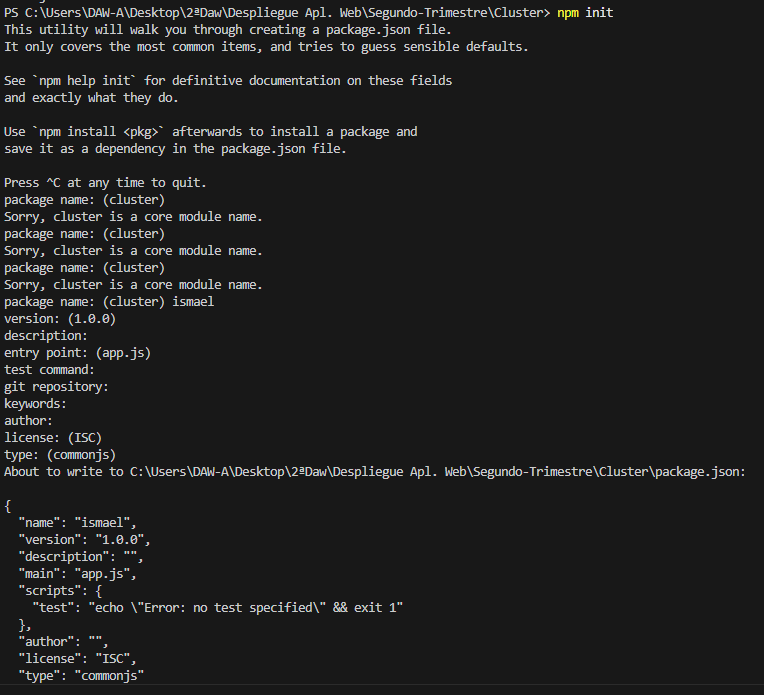
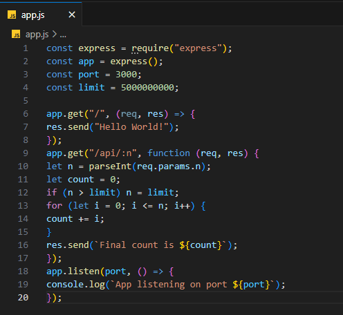
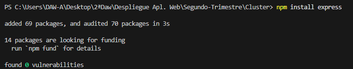
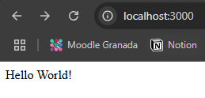
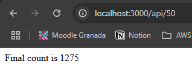
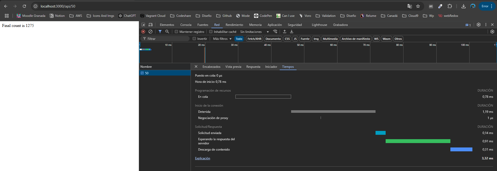
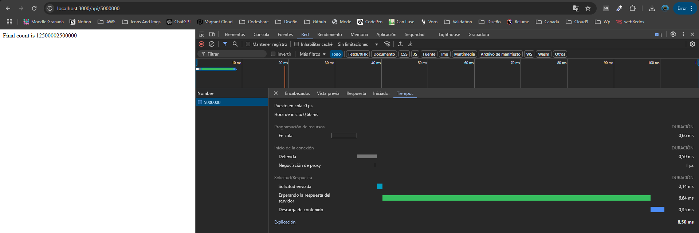
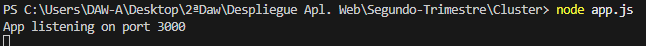
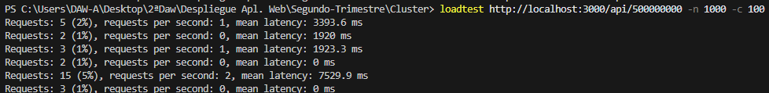


## Pruebas correctas y bien documentadas de despliegue de la aplicación con cluster

### Prueba 1: Inicio del servidor con clúster

1. **Descripción**: Iniciar el servidor utilizando clústeres.
2. **Comando**:
   ```sh
   node app2.js
Resultado esperado: El servidor debería iniciar múltiples procesos y estar disponible en http://localhost:3000.
Prueba 2: Solicitud a la ruta raíz
Descripción: Realizar una solicitud GET a la ruta raíz / en un entorno con clúster.
Comando:
curl http://localhost:3000/
Resultado esperado: La respuesta debería ser "Hello World!" y debería ser manejada por uno de los procesos del clúster.
Prueba 4: Prueba de carga
Descripción: Realizar una prueba de carga para evaluar el rendimiento con clústeres.
Comando:
loadtest http://localhost:3000/api/500000 -n 1000 -c 100
Resultado esperado: Evaluar el tiempo de respuesta y el rendimiento del servidor bajo carga, observando mejoras en comparación con la versión sin clústeres.
Resultados de las pruebas
Prueba 1: El servidor inició correctamente con múltiples procesos y estuvo disponible en http://localhost:3000.
Prueba 2: La solicitud a la ruta raíz devolvió "Hello World!" y fue manejada por uno de los procesos del clúster.
Prueba 3: La solicitud a la ruta /api/500000 devolvió el resultado esperado, manejada por uno de los procesos del clúster.
Prueba 4: La prueba de carga mostró mejoras en el rendimiento del servidor bajo alta concurrencia en comparación con la versión sin clústeres.
Resultados de las pruebas:
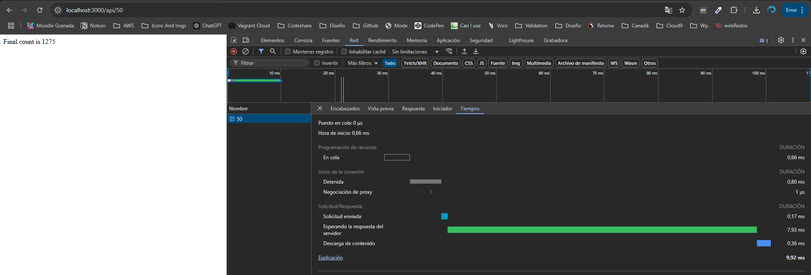
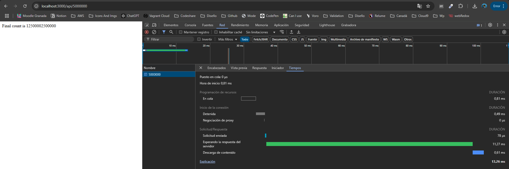
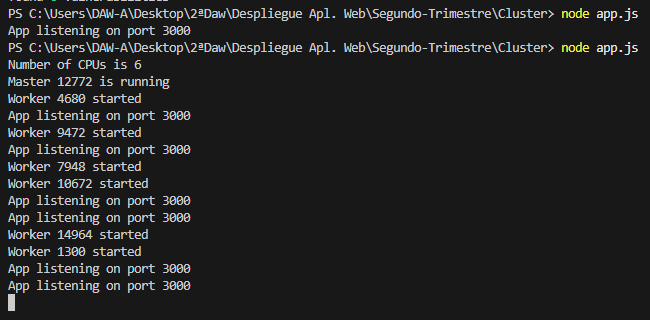
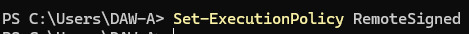
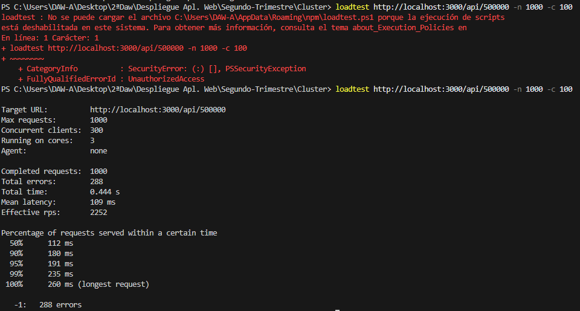
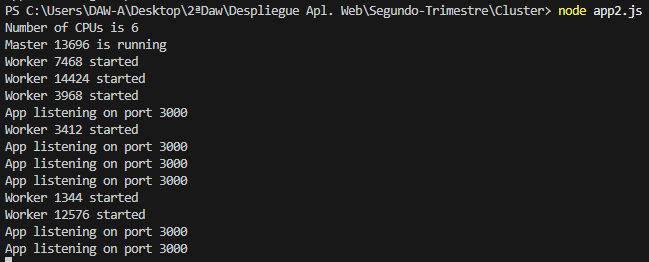
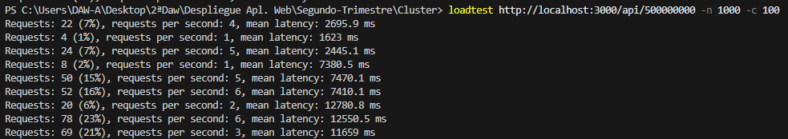

## Pruebas correctas y bien documentadas de todas las opciones con PM2 y cuestiones

### pm2 ls:

El comando `pm2 ls` se utiliza para listar todos los procesos gestionados por PM2. La salida del comando muestra una tabla con información detallada sobre cada aplicación gestionada por PM2. Aquí tienes una explicación de cada columna en la salida:

- **id**: El identificador del proceso.
- **name**: El nombre de la aplicación.
- **namespace**: El espacio de nombres al que pertenece la aplicación.
- **version**: La versión de la aplicación.
- **mode**: El modo de ejecución (fork o cluster).
- **pid**: El identificador del proceso del sistema operativo.
- **uptime**: El tiempo que lleva el proceso en ejecución.
- **↺**: El número de reinicios que ha tenido el proceso.
- **status**: El estado actual del proceso (online, stopped, etc.).
- **cpu**: El porcentaje de CPU que está utilizando el proceso.
- **mem**: La cantidad de memoria que está utilizando el proceso.
- **user**: El usuario que está ejecutando el proceso.
- **watching**: Indica si el proceso está siendo monitoreado para cambios en el código fuente.

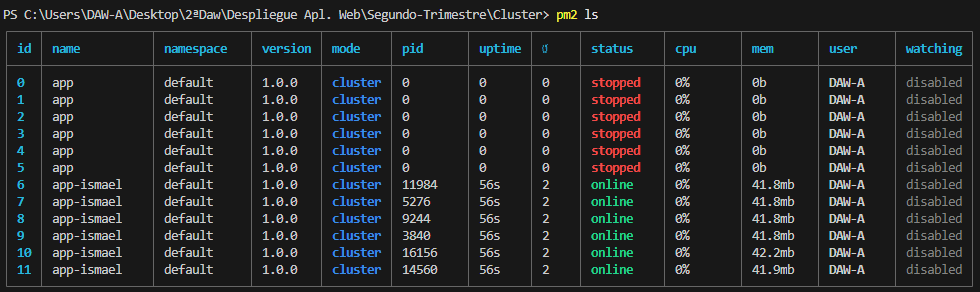

### pm2 logs:

El comando `pm2 logs` se utiliza para ver los registros (logs) de todas las aplicaciones gestionadas por PM2. Este comando muestra las últimas líneas de los archivos de registro de PM2, incluyendo tanto los registros de salida estándar como los de error.

#### Salida del comando `pm2 logs`
La salida del comando muestra varias secciones:

- **PM2 log**: Muestra los registros del propio PM2, incluyendo eventos como el inicio y la detención de aplicaciones, reinicios, y otros mensajes del sistema PM2.
- **app-error.log**: Muestra las últimas líneas del archivo de registro de errores de la aplicación `app`.
- **app-out.log**: Muestra las últimas líneas del archivo de registro de salida estándar de la aplicación `app`.
- **app-ismael-error-<id>.log**: Muestra las últimas líneas de los archivos de registro de errores de las instancias de la aplicación `app-ismael`.
- **app-ismael-out-<id>.log**: Muestra las últimas líneas de los archivos de registro de salida estándar de las instancias de la aplicación `app-ismael`.

#### Uso del comando
El comando `pm2 logs` es útil para monitorear y depurar aplicaciones en tiempo real, ya que te permite ver los mensajes de registro generados por tus aplicaciones y por PM2.

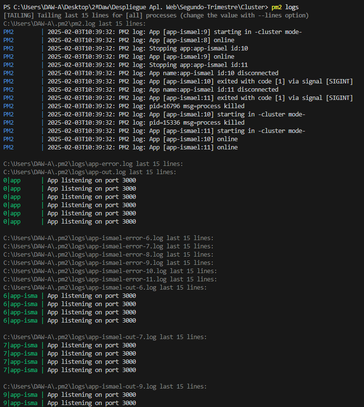

### pm2 monit:

El comando `pm2 monit` se utiliza para monitorear en tiempo real las aplicaciones gestionadas por PM2. Este comando abre una interfaz interactiva en la terminal que muestra información detallada sobre el estado de las aplicaciones, el uso de recursos y los registros.

#### Salida del comando `pm2 monit`
La salida del comando se divide en varias secciones:

- **Process List**: Muestra una lista de todos los procesos gestionados por PM2, incluyendo:
  - **ID**: El identificador del proceso.
  - **Nombre**: El nombre de la aplicación.
  - **Memoria**: La cantidad de memoria que está utilizando el proceso.
  - **CPU**: El porcentaje de CPU que está utilizando el proceso.
  - **Estado**: El estado actual del proceso (online, stopped, etc.).
- **App Logs**: Muestra los registros (logs) en tiempo real de las aplicaciones, tanto de salida estándar como de error.
- **Custom Metrics**: Muestra métricas personalizadas definidas por el usuario (si las hay).
- **Metadata**: Muestra metadatos sobre la aplicación seleccionada, incluyendo:
  - **App Name**: El nombre de la aplicación.
  - **Namespace**: El espacio de nombres al que pertenece la aplicación.
  - **Version**: La versión de la aplicación.
  - **Restarts**: El número de reinicios que ha tenido el proceso.
  - **Uptime**: El tiempo que lleva el proceso en ejecución.
  - **Script path**: La ruta del script que se está ejecutando.
  - **Script args**: Los argumentos del script (si los hay).
  - **Interpreter**: El intérprete utilizado para ejecutar el script (por ejemplo, node).

#### Uso del comando
El comando `pm2 monit` es útil para monitorear el rendimiento y el estado de las aplicaciones en tiempo real, permitiendo a los desarrolladores y administradores de sistemas identificar rápidamente problemas y tomar medidas correctivas.

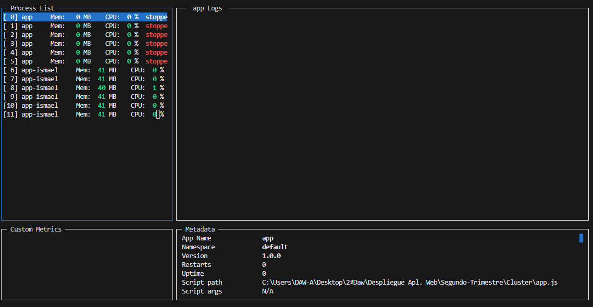